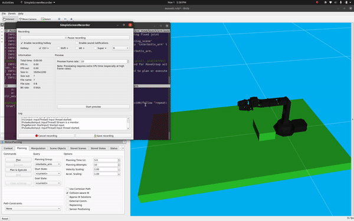
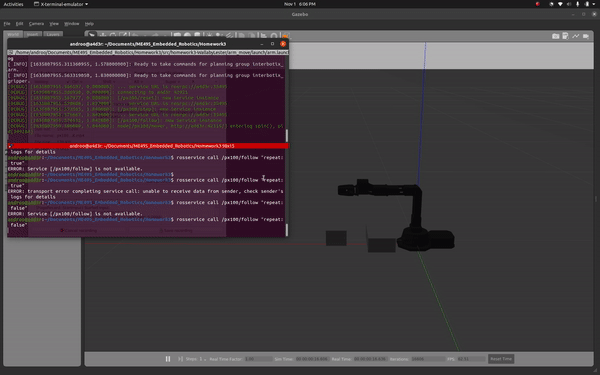

## MOTION PLANNING WITH THE PX100 ROBOT ARM
**Andru Liu**

## Overview
This package makes use of the MoveIt Python API to perform motion planning using a robot arm. The program plans a path to a target object without hitting a collision object and performs said path, writing the waypoint to the ros parameter server. A MoveItErrorCode will be returned with a non-valid path=`-1`

The robot can also be made to follow waypoints in the parameter server. The package can be run using an actual robot (Interbotix px100 model), RVIZ, or Gazebo.  

The package depends on the `Interbotix` series of packages: `interbotix_ros_core`, `interbotix_ros_manipulators`, and `interbotix_ros_toolboxes`. 

## Usage Instructions
To launch the package use the roslaunch command `roslaunch arm_move <launch_file>`.

The launch files are listed below:

`arm_box.launch` ~ full sized launch file with all Gazebo, RVIZ, and actual arguments

`arm.launch` ~ use this launch file with arguments to launch different options:

&nbsp;&nbsp;&nbsp;&nbsp;&nbsp;&nbsp;`use_actual:=true` ~ use for running the code on the real robot

&nbsp;&nbsp;&nbsp;&nbsp;&nbsp;&nbsp;

&nbsp;&nbsp;&nbsp;&nbsp;&nbsp;&nbsp;`use_fake:=true` ~ use to run the RVIZ motion planning with a table collision object 

&nbsp;&nbsp;&nbsp;&nbsp;&nbsp;&nbsp;

&nbsp;&nbsp;&nbsp;&nbsp;&nbsp;&nbsp;`use_gazebo:=true` ~ use to run the Gazebo simulation with a world file containing the robot, realsense box, and small object to be &nbsp;&nbsp;&nbsp;&nbsp;&nbsp;&nbsp;grasped

&nbsp;&nbsp;&nbsp;&nbsp;&nbsp;&nbsp;

This package contains a preset waypoints list if you would like to move the robot immediately. 

To move the robot and set the scene use the services below:

`rosservice call /px100/reset` ~ use to reset the scene and place the realsense object at user-input pose values. It includes an optional argument `clr_waypoints` boolean value to clear waypoints server if desired.

Sample call matching the gazebo and rviz placement of the realsense box: 
```
position: 
    x: 0.12 
    y: 0.0
    z: 0.025
orientation: 
    x: 0.0
    y: 0.0
    z: 0.0
    w: 1.0
clr_waypoints: false
```

`rosservice call /px100/step` ~ use to move the robot to a specific user-input pose end effector goal position. It will append the waypoint to the parameter server if successful. A MoveItErrorCode will be returned: `valid=1` and `non-valid=-1`. 

Sample call of valid waypoint: 
```
position: 
    x: 0.074819
    y: 0.0
    z: 0.23243
orientation: 
    x: 0.0
    y: 0.0
    z: 0.0
    w: 1.0
gripper: false
```

`rosservice call /px100/follow` ~ use to make the robot follow the waypoints in the parameter server. If run without clearing the server it will follow the preset waypoints. If the `clr_waypoints` argument was set to true you will have to run the `/px100/step` service first to add waypoints to the parameter server. Use the argument `"repeat:true"` to make the robot repeat the cycle or `"repeat:false"` to run the cycle only once.

This package features a rostest option to test the code's ability to output the correct MoveItErrorCode. The test makes use of the `/px100/reset` and `/px100/step` services. The test returns `SUCCESS` if the error code matches a non-valid and valid pose. Use `catkin_make run_tests` from the root of the workspace to run these tests.

## Configuration Instructions
The preset waypoints are contained in the `waypoints.yaml` file. The file takes `Pose` data and a `bool` value for gripper open/closed. It is automatically loaded into the parameter server but can be cleared with the `/px100/reset` service mentioned above. 

If you would like to add the same small object used in the Gazebo simulation to the RVIZ planning scene, uncomment the line `self.add_airpod()` in the mover node. This can be used to see where the robot arm would collide with that object or be able to grasp it. 
