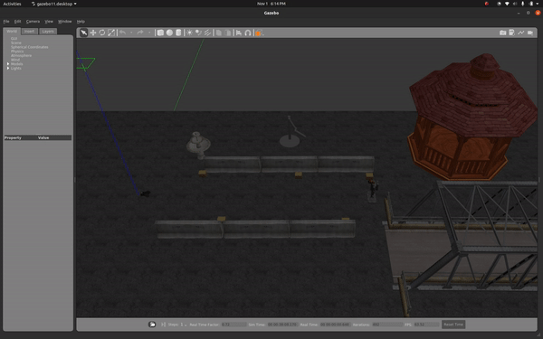

# GAZEBO DIFFERENTIAL DRIVE ROBOT
**Andru Liu**

## Overview 
This package contains a differential-drive robot that can be simulated in Gazebo and controlled by ROS. It also offers the ability to view the robot in RVIZ for configuration viewing. 

The robot moves in a straight line flipping over in order to change directions. 

## Usage Instructions 
To launch the package use the roslaunch command `roslaunch diff_drive <launch_file>`.

The launch files are listed below:
`ddrive_rviz.launch` - Launch file for visualizing the robot in RVIZ. Add the argument `gui:=true` in order to launch the `joint_state_publisher_gui` to move the wheels. 

There is also an optional rviz config for viewing the robot with the odom frame as the fixed frame to see where the robot believes it to be based on its wheel odometry. Uncomment the line for `ddrive_odom.rviz` in the `ddrive_rviz.launch` file and comment out the `ddrive.rviz` line to use this config. 

`ddrive.launch` - Launch file for running the robot in gazebo. The simulation is started paused, so unpause when you would like the simulation to run.

## Configuration Instructions
To adjust the robot parameters, use the ddrive.yaml file. The file takes parameters for box:length, width, height, and mass, wheel: height, radius, and mass, and caster: radius and mass. 

The yaml file also takes the pub frequency and velocity used for the movement commands. Increase the velocity if you would like the robot to drive faster. 

## Differential Drive Robot

